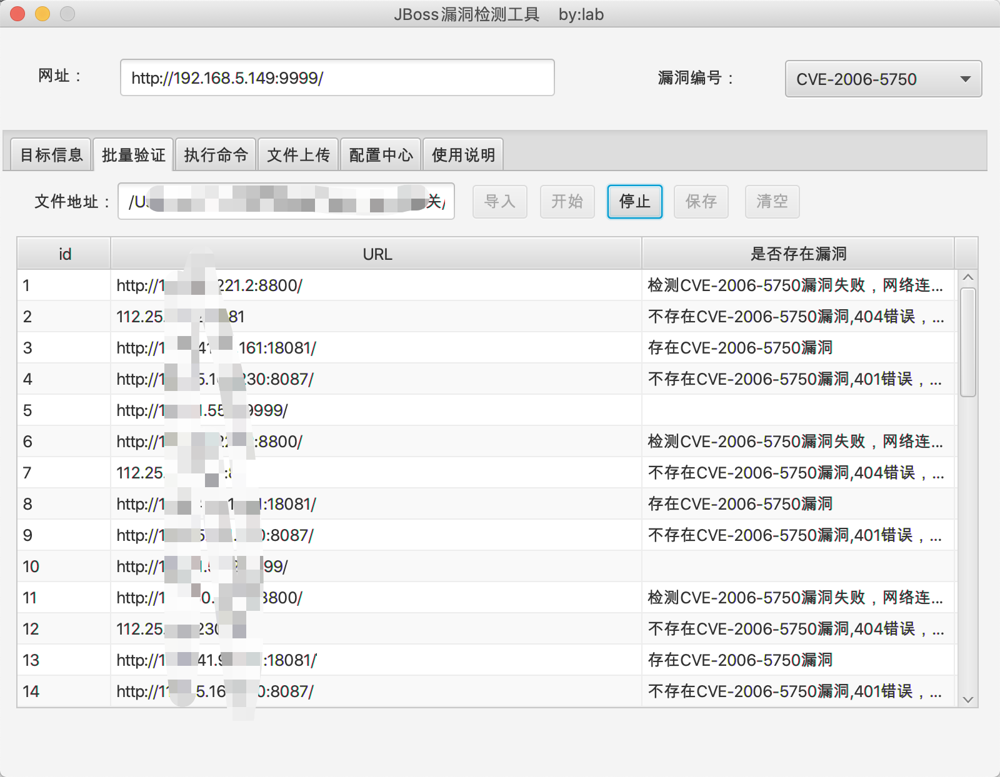
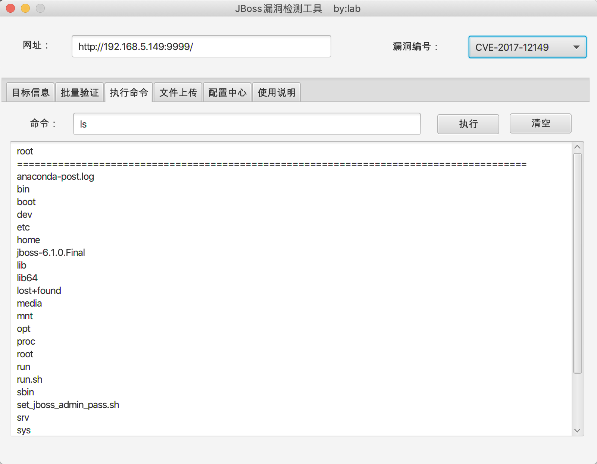
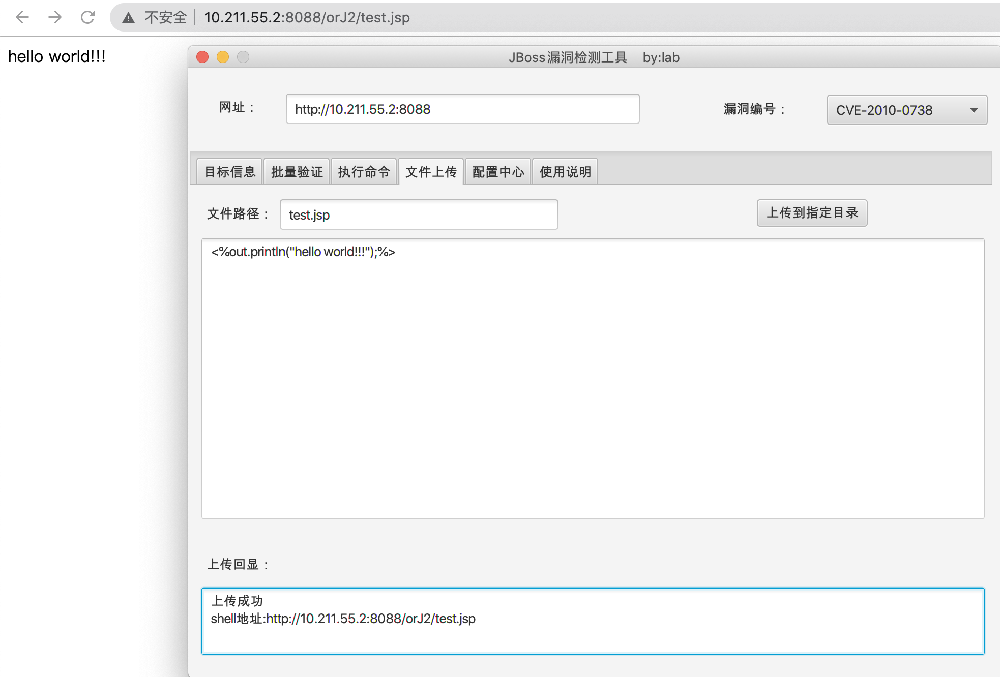
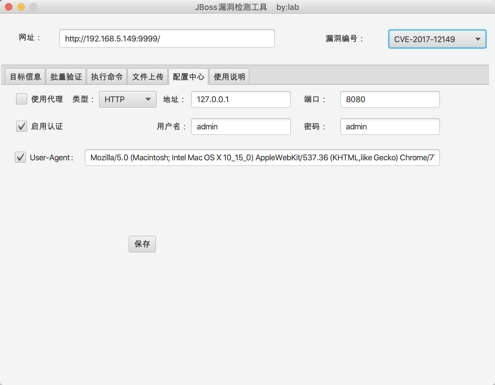

# JBoss漏洞检测工具
JBoss相关漏洞的验证工具，包括有CVE-2006-5750,CVE-2007-1036,CVE-2010-0738,CVE-2010-1871,CVE-2013-4810,CVE-2015-7501,CVE-2017-7504,CVE-2017-12149等漏洞。

CVE-2010-1871,CVE-2013-4810,CVE-2015-7501,CVE-2017-7504,CVE-2017-12149可以执行命令。

### 具体功能截图：

#### 1.单一URL漏洞验证

#### 2.单一漏洞批量扫描

#### 3.命令执行

#### 4.文件上传

> 使用CVE-2006-5750,CVE-2007-1036,CVE-2010-0738进行文件上传时，文件路径为文件名，shell路径为http://ip:port/四位随机字符/文件名。

#### 5.配置中心.png

### 其他：

**1.目前有误报，请以自己测试的结果为准，勿信工具。**

**2.仅供安全人员进行有授权的验证,勿用于非法测试。**

**3.有更好的方法或者建议请随时指出。**

