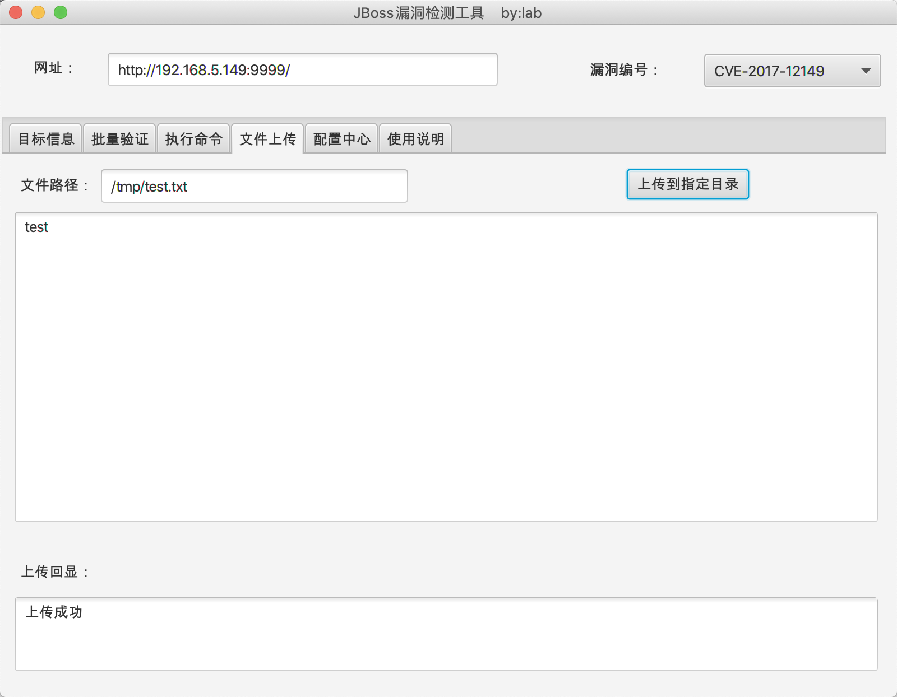
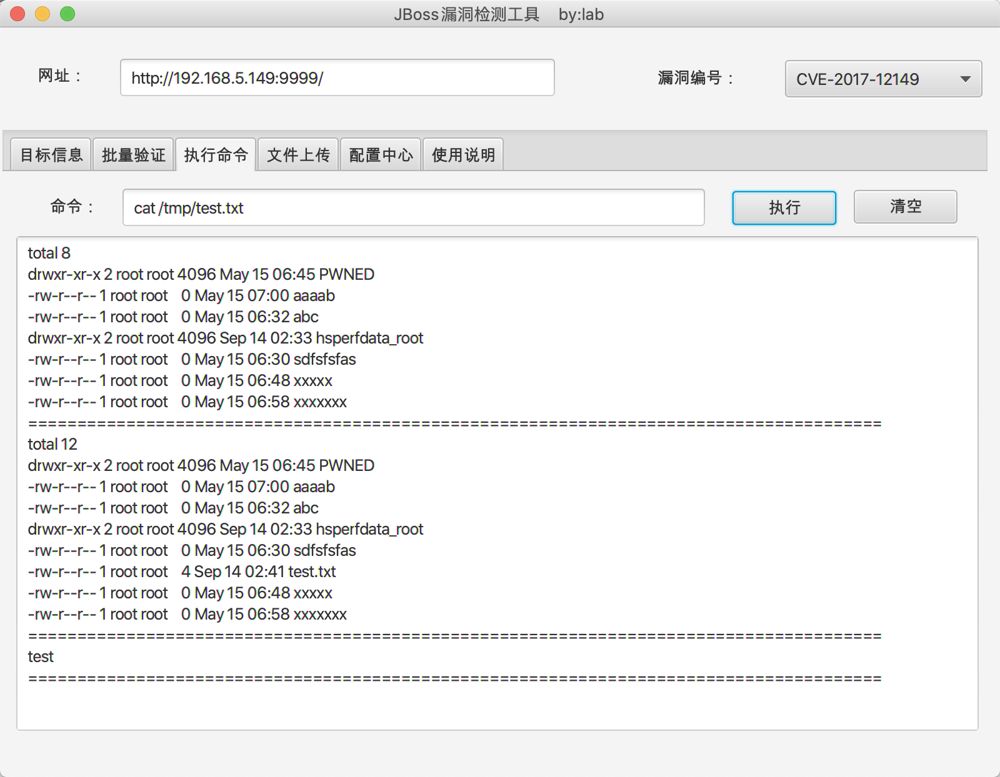

# JBoss漏洞检测工具
**目前还有些问题，暂不放出。**

JBoss相关漏洞的验证工具，包括有CVE-2006-5750,CVE-2007-1036,CVE-2010-0738,CVE-2010-1871,CVE-2013-4810,CVE-2015-7501,CVE-2017-7504,CVE-2017-12149等漏洞。

CVE-2010-1871,CVE-2013-4810,CVE-2015-7501,CVE-2017-7504,CVE-2017-12149可以执行命令。

### 具体功能截图：

#### 1.单一URL漏洞验证

#### 2.单一漏洞批量扫描

#### 3.命令执行

#### 4.文件上传

#### 5.配置中心.png

