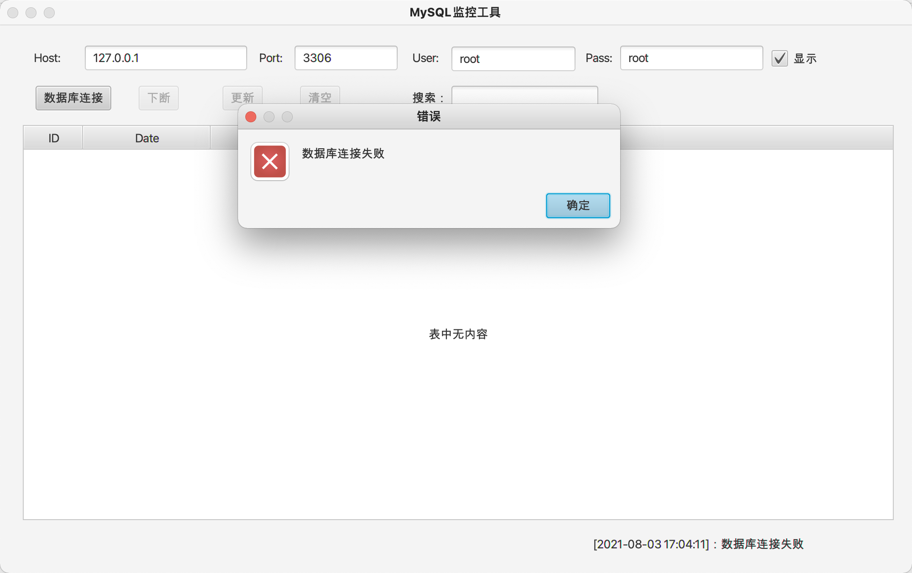
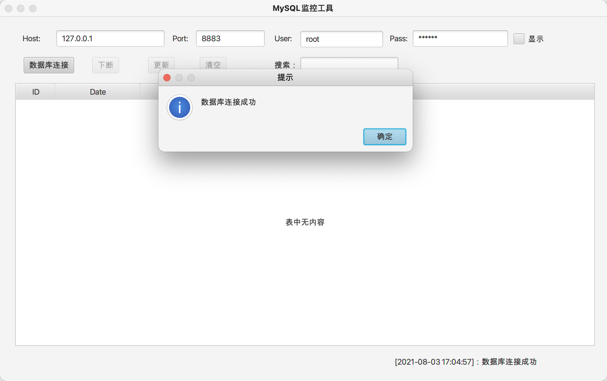
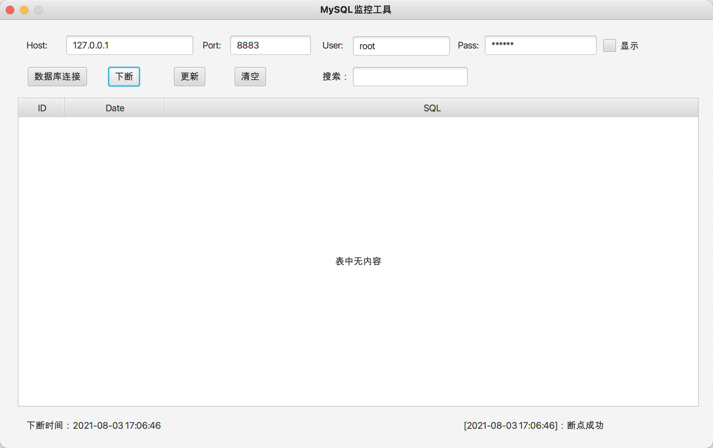
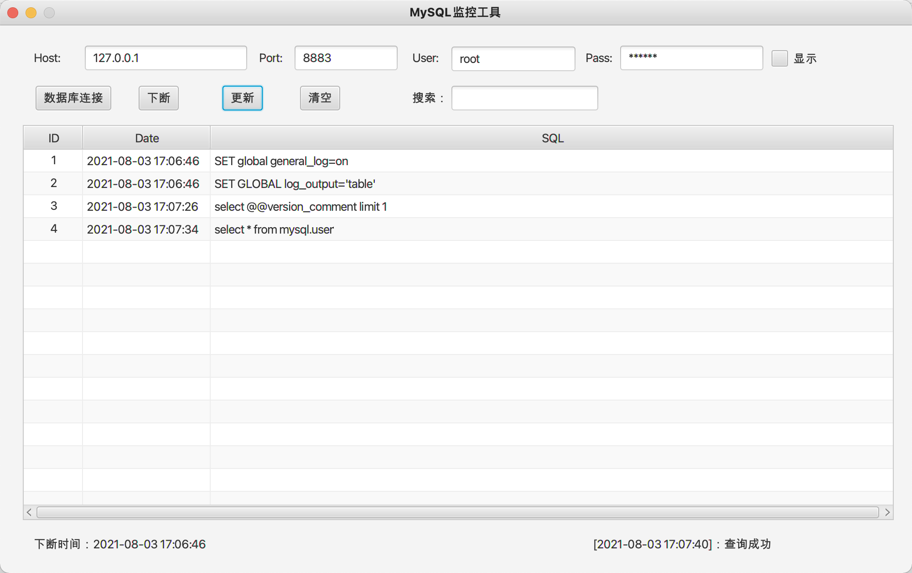
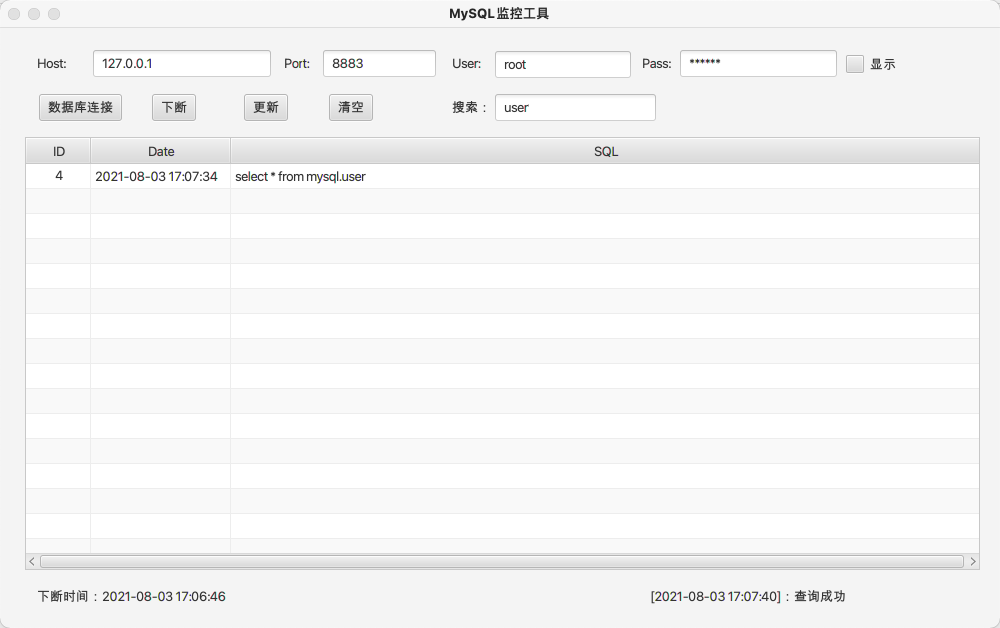
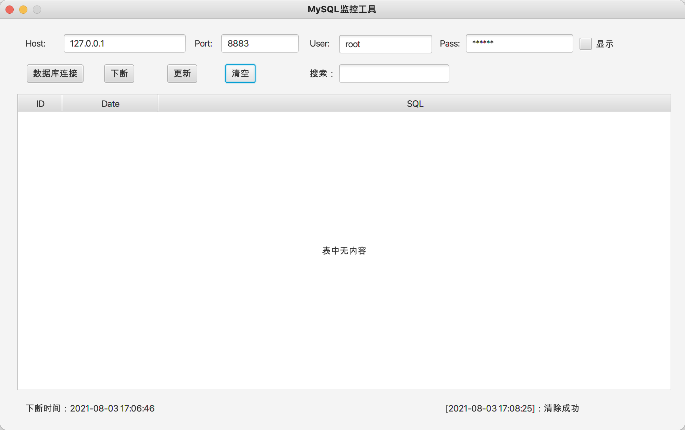
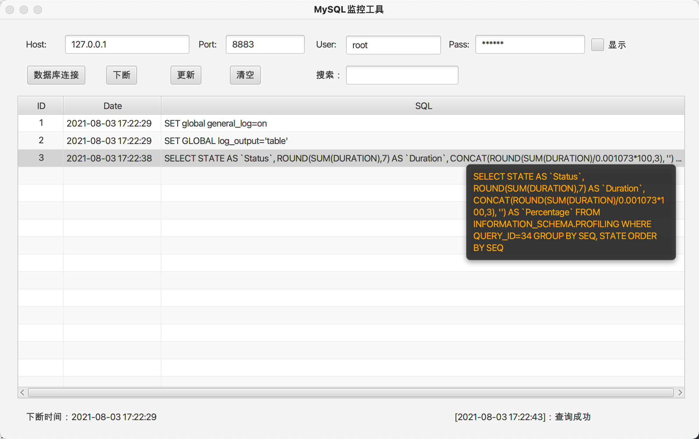

# JavaTools

一些Java编写的小工具。

## JBoss

JBoss漏洞检测工具。包括有CVE-2006-5750,CVE-2007-1036,CVE-2010-0738,CVE-2010-1871,CVE-2013-4810,CVE-2015-7501,CVE-2017-7504,CVE-2017-12149等漏洞。

CVE-2010-1871,CVE-2013-4810,CVE-2015-7501,CVE-2017-7504,CVE-2017-12149可以执行命令。


## Shiro

ShiroScan和ShiroExploit。

### ShiroScan


### ShiroExploit


**cmd内存Shell**


**SpringBoot环境下写入冰蝎Shell**


**使用蚁剑连接**


更多使用说明参考:https://github.com/fupinglee/JavaTools/blob/master/Shiro/使用说明-v2.3.pdf


## Tools

### MySQLMonitor

MySQL实时监控工具（代码审计、黑盒测试辅助工具）

#### 使用说明

##### 数据库连接

数据库连接失败，下断、更新、清空等按钮不可用


数据库连接成功，下断按钮可以使用，更新、清空等按钮不可用


##### 下断

下断点后可以更新和清空


##### 更新

点击更新查看执行的SQL语句


#####搜索

在搜索框里输入内容可以对所需要的sql语句进行过滤


#####清空

清空按钮清空表格里面的内容


#####其他

单击选中一行后，鼠标移动可以悬浮显示该行的sql语句


>双击可以复制sql语句到剪贴板上


### DirScan

一款**不太好用**的目录扫描工具，dic里面是字典（模仿的是k8，字典也是k8里面的）。


### NameChange

中文名字转拼音。

使用方法

```
java -jar NameChange.jar -f  姓名.txt -m 0 -o result.txt
java -jar -Dfile.encoding=utf-8 NameChange.jar -f  姓名.txt -m 0 -o result.txt//显示在控制台并保存到result.txt中
java -jar -Dfile.encoding=utf-8 NameChange.jar -f  姓名.txt -m 0 //显示在控制台，并保存在当前目录下，保存名字为"姓名_result.txt"
```


以王大锤为例进行转换。

|   方法    |  转换结果  |
| :-------: | :--------: |
|     1     |    wdc     |
|     2     |   wangdc   |
|     3     |  dc.wang   |
|     4     | dacha.wang |
| 0或者其他 | wangdachui |

### WebCheck

根据url查看标题、Server。


根据IP列表探测端口


双击是打开，右键是复制到剪贴板。保存位置是当前目录下，格式为csv，方便查看。


## 其他：

**仅供安全人员进行有授权的验证,勿用于非法测试。**