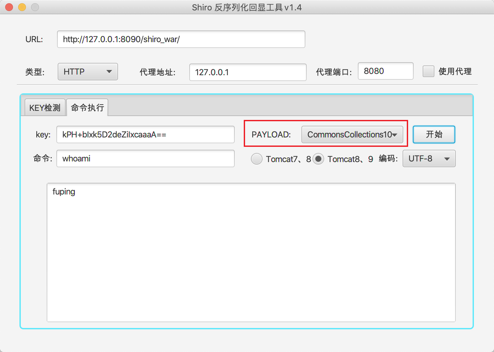

# Shiro相关工具
ShiroScan和ShiroExploit。ShiroScan是从ShiroExploit剥离出来的一个Shiro反序列化扫描工具，用于检测存在Shiro反序列化漏洞的key值。

## ShiroScan

用于检测存在Shiro反序列化漏洞的key值。有三种方式进行检测，第一种是利用URLDNS进行检测，第二种利用命令执行进行检测，第三种使用`SimplePrincipalCollection`序列化后进行检测（XCheck，即Xray Check）。

运行效果

## ShiroExploit

当前版本1.4，1.5新增XCheck。

下一个版本2.0，新增内存shell，完成tomcat6/7/8/9下的回显[**参考**：https://github.com/zema1/ysoserial/]。

#### v1.4

