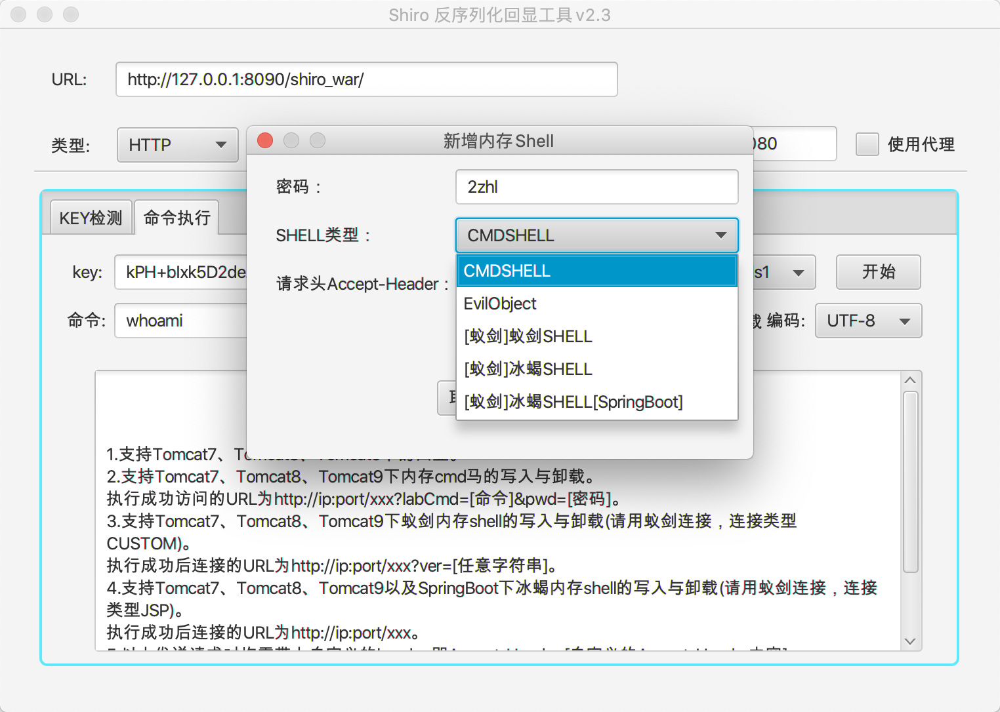
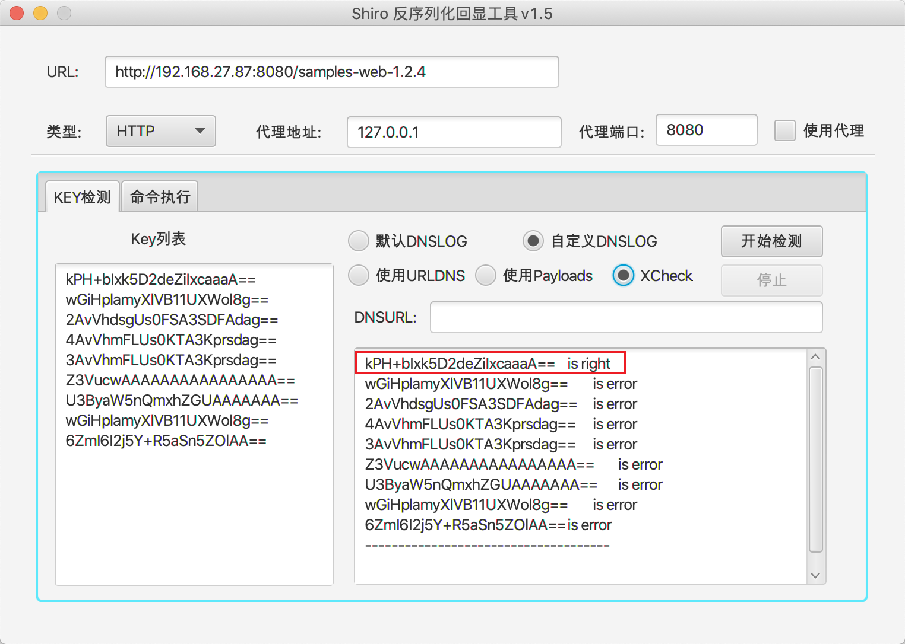
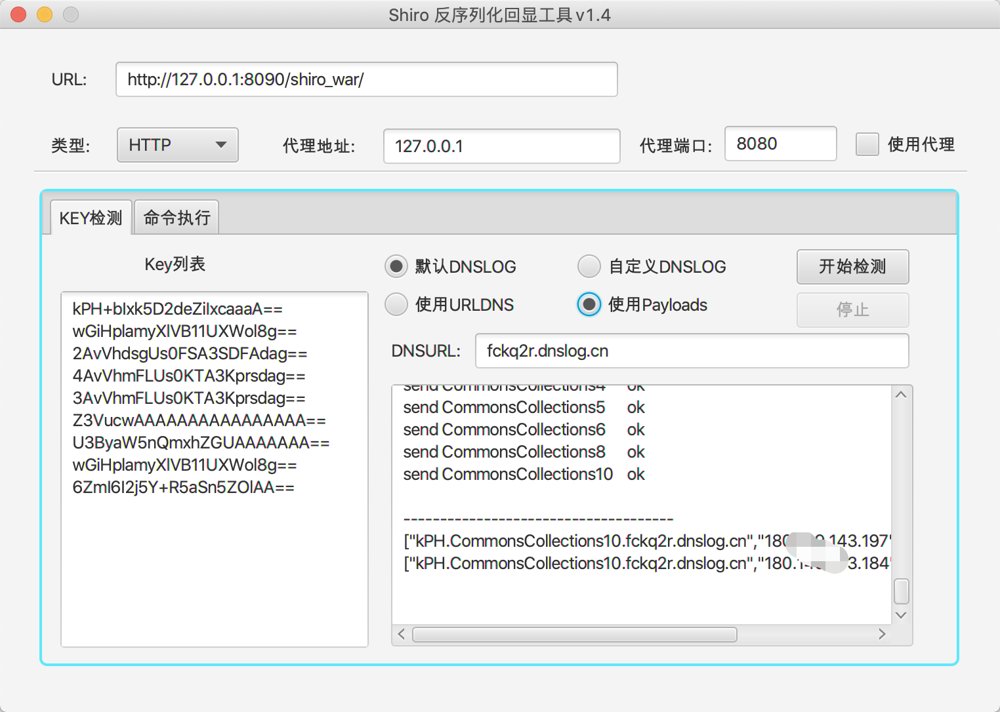
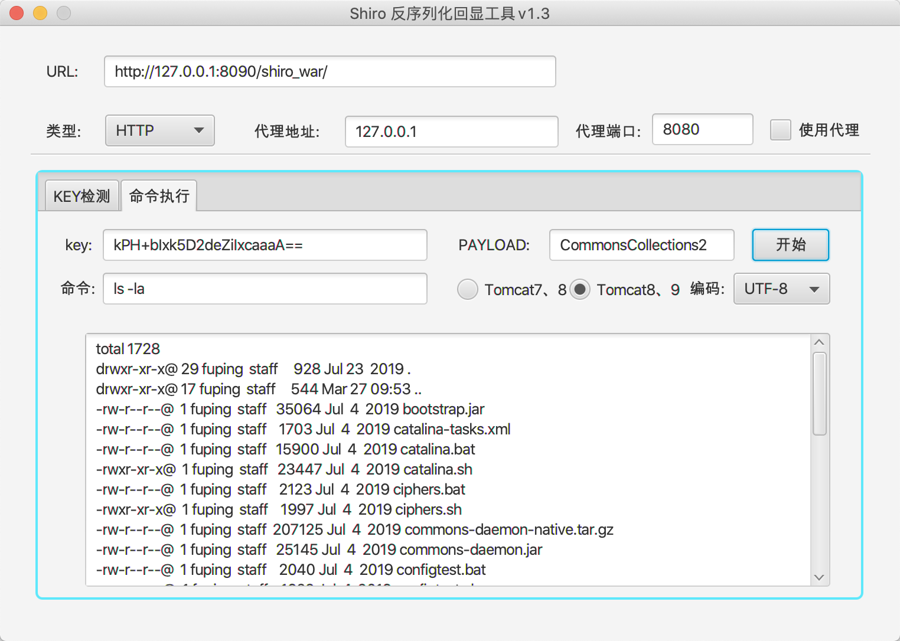
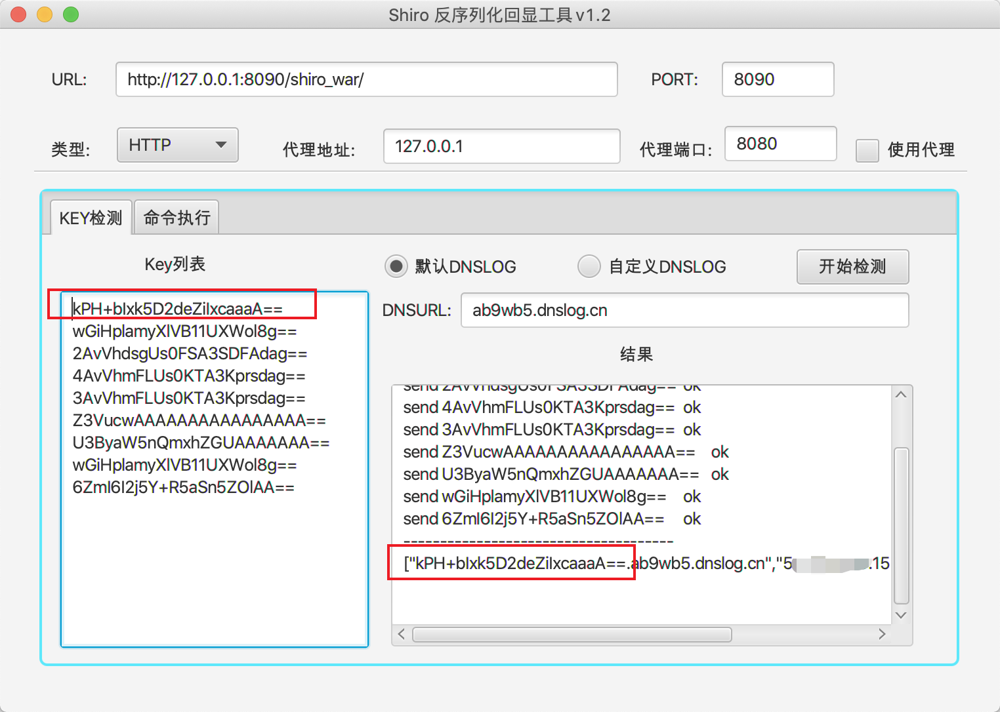
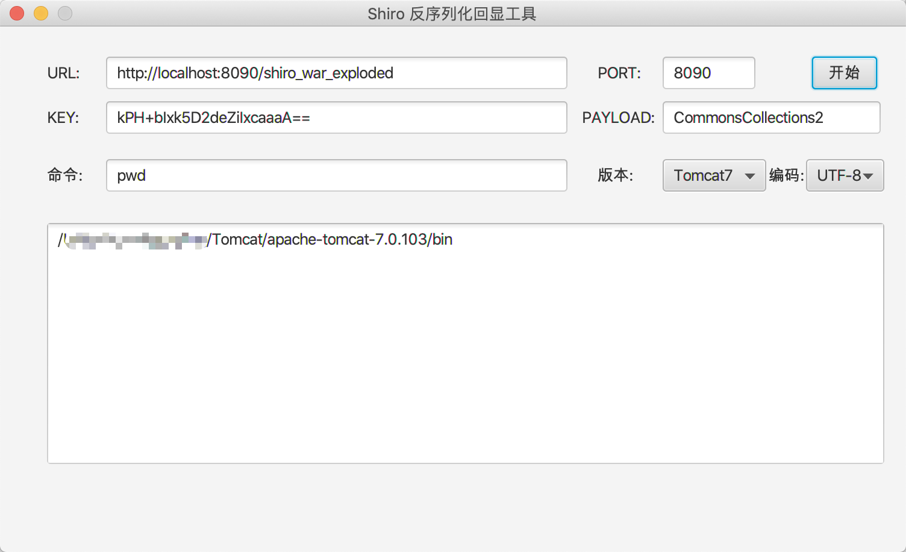

# Shiro相关工具
ShiroScan和ShiroExploit。ShiroScan是从ShiroExploit剥离出来的一个Shiro反序列化扫描工具，用于检测存在Shiro反序列化漏洞的key值。ShiroExploit是反序列化回显利用工具，包含ShiroScan的全部功能。

## ShiroScan

用于检测存在Shiro反序列化漏洞的key值。有三种方式进行检测，第一种是利用URLDNS进行检测，第二种利用命令执行进行检测，第三种使用`SimplePrincipalCollection`序列化后进行检测（XCheck，即Xray Check）。

运行效果

## ShiroExploit

当前版本2.3.

**支持：**

 1.支持Tomcat7、Tomcat8、Tomcat9下的回显。

 2.支持Tomcat7、Tomcat8、Tomcat9下内存cmd马的写入与卸载。

 执行成功访问的URL为http://ip:port/xxx?labCmd=[命令]&pwd=[密码]。

 3.支持Tomcat7、Tomcat8、Tomcat9下蚁剑内存shell的写入与卸载(请用蚁剑连接，连接类型CUSTOM)。 

执行成功后连接的URL为http://ip:port/xxx?ver=[任意字符串]。

 4.支持Tomcat7、Tomcat8、Tomcat9以及SpringBoot下冰蝎内存shell的写入与卸载(请用蚁剑连接，连接类型JSP)。 执行成功后连接的URL为http://ip:port/xxx。

> **以上发送请求时均需带上自定义的header：Accept-Header:[自定义的Accept-Header内容]**

#### v2.3

使用说明：https://github.com/fupinglee/JavaTools/blob/master/Shiro/使用说明-v2.3.pdf

#### v2.0

支持内存cmd shell的写入与卸载

#### v1.5

新增使用`SimplePrincipalCollection`序列化后进行检测（XCheck，即Xray Check）。参考https://mp.weixin.qq.com/s/do88_4Td1CSeKLmFqhGCuQ

#### v1.4

增加使用payloads来检测key，增加CommonsCollections10，支持commons-collections3.x的回显

PAYLOAD可以选择，不用手动输入

#### v1.3

去除输入端口，自动匹配。去掉模式选择，根据`ByteChunk`或`ByteBuffer`来输出。

Tomcat7及低版本Tomcat8输出时需要使用`ByteChunk`，Tomcat9及高版本Tomcat8使用`ByteBuffer`

#### v1.2

新增使用URLDNS检测key值。

选择默认DNSLOG时会自动生成一个DNSURL，然后根据Key列表进行检测。当找到key值时，任务结束，可以看到DNSLOG的请求记录。

选择自定义DNSLOG时，需要自己输入一个DNSLOG平台的地址，然后自行去平台查看。

#### v1.1

新增代理模式，支持Tomcat9。

Tomcat7下效果

